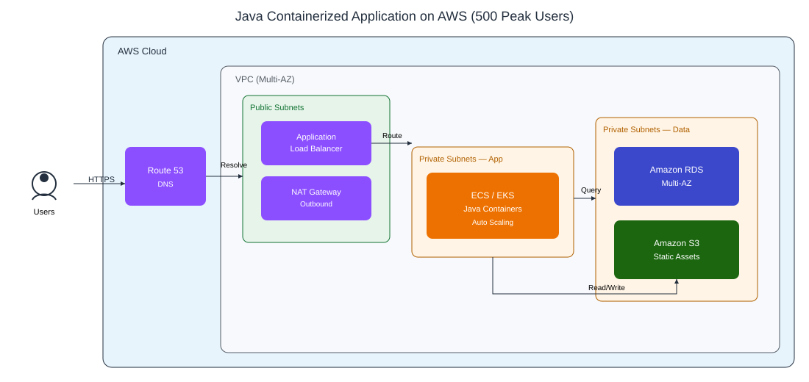

# AWS Research Project

**Author:** Adeniyi Abdulazeez (`hayzeddev123`)  
**Date:** August 2026  
**Topic:** Introduction to Cloud Computing Concepts – Critical Thinking Questions

---

## 1. What is Cloud Computing?

**Definition (in my own words):**  
Cloud computing is the delivery of computing resources (such as servers, storage, databases, networking, software, and analytics) over the internet on a pay-as-you-go basis. Instead of owning and maintaining physical hardware, users can access these resources from a cloud provider whenever they need them.

**Basic Characteristics:**
- **On-demand self-service** – Users can provision resources without human interaction with the provider.
- **Broad network access** – Resources are available over the network from anywhere.
- **Resource pooling** – Multiple customers share the provider’s resources (multi-tenancy).
- **Rapid elasticity / Scalability** – Resources can be scaled up or down quickly based on demand.
- **Measured service** – Usage is monitored and billed based on actual consumption.

**Difference from Traditional On-Premise Infrastructure:**
| Aspect              | Traditional On-Premise                  | Cloud Computing                          |
|---------------------|-----------------------------------------|------------------------------------------|
| Ownership           | Organization owns and maintains hardware | Provider owns the hardware               |
| Upfront Cost        | High capital expenditure (CapEx)        | Low or no upfront cost (OpEx)            |
| Scalability         | Slow and expensive                      | Fast and elastic                         |
| Maintenance         | Handled by internal IT team             | Handled by cloud provider                |
| Accessibility       | Limited to company network              | Accessible from anywhere via internet    |
| Payment Model       | Buy and maintain servers                | Pay only for what you use                |

---

## 2. Types of Cloud Computing Services

### Infrastructure as a Service (IaaS)
Provides virtualized computing resources over the internet (servers, storage, networking).

- **Examples:** Amazon EC2, Amazon S3, Google Compute Engine, Microsoft Azure Virtual Machines
- **Use Cases:** Lift-and-shift migration of existing applications, development/test environments, custom infrastructure that needs full control over the operating system.

### Platform as a Service (PaaS)
Provides a platform for developing, running, and managing applications without managing the underlying infrastructure.

- **Examples:** AWS Elastic Beanstalk, Google App Engine, Heroku, Azure App Service
- **Use Cases:** Application development and deployment, especially for web and mobile apps where developers want to focus only on code.

### Software as a Service (SaaS)
Delivers complete software applications over the internet on a subscription basis.

- **Examples:** Gmail, Microsoft 365, Salesforce, Dropbox, Zoom
- **Use Cases:** End-user applications where no installation or maintenance is required by the customer.

**Summary Hierarchy:**  
IaaS (most control) → PaaS → SaaS (least control / most managed)

---

## 3. Cloud Deployment Models

### Public Cloud
Resources are owned and operated by a third-party provider and shared among multiple customers over the internet.

- **When to use:** Startups, variable workloads, cost-sensitive projects, applications that do not require strict data isolation.

### Private Cloud
Cloud infrastructure is used exclusively by a single organization. It can be hosted on-premises or by a third party.

- **When to use:** Highly regulated industries (banking, healthcare, government), applications with strict security or compliance requirements.

### Hybrid Cloud
A combination of public and private clouds that allows data and applications to be shared between them.

- **When to use:** Organizations that want to keep sensitive data private while using public cloud for less critical workloads, or for cloud bursting during peak demand.

---

## 4. Benefits of Cloud Computing

Compared to traditional data centers, cloud computing offers:

- **Cost Efficiency** – No large capital investment in hardware. Pay only for what you use.
- **Scalability & Elasticity** – Easily scale resources up or down based on demand.
- **Reliability & High Availability** – Cloud providers offer multiple Availability Zones and Regions with built-in redundancy.
- **Speed of Deployment** – Resources can be provisioned in minutes instead of weeks or months.
- **Global Reach** – Deploy applications close to users worldwide.
- **Automatic Updates & Maintenance** – Provider handles hardware maintenance, security patches, and upgrades.
- **Disaster Recovery** – Easier and cheaper to implement backup and recovery strategies.

---

## 5. Concerns around Cloud Computing

| Concern              | Description                                                                 | Mitigation                                      |
|----------------------|-----------------------------------------------------------------------------|-------------------------------------------------|
| **Data Security**    | Data is stored on shared infrastructure controlled by a third party         | Encryption, IAM, security groups, compliance tools |
| **Compliance**       | Meeting industry regulations (GDPR, HIPAA, PCI-DSS, etc.)                   | Use compliant services and proper configurations |
| **Vendor Lock-in**   | Difficulty moving applications and data from one provider to another        | Use open standards, multi-cloud strategies, containers |
| **Downtime / Outages** | Even major providers experience occasional service disruptions            | Multi-AZ / multi-region architectures, SLA review |
| **Cost Overruns**    | Unexpected high bills due to poor resource management                       | Monitoring, budgets, alerts, right-sizing        |
| **Internet Dependency** | Requires reliable internet connectivity                                  | Hybrid designs or edge solutions                 |

---

## 6. Basic Cloud Architecture

**How the services interact:**

- **Amazon VPC** – Creates an isolated virtual network for the resources.
- **Amazon EC2** – Provides the compute instances that run the application.
- **Amazon S3** – Stores static assets, backups, and objects.
- **Internet Gateway** – Allows communication between the VPC and the internet.
- **Security Groups / NACLs** – Control inbound and outbound traffic.
- **Subnets** – Separate public-facing resources from private backend resources.

This is a classic three-tier style architecture commonly used on AWS.

---

## 7. Explanation of Key Terms

| Term                    | Definition                                                                 | Example / Significance                                      |
|-------------------------|----------------------------------------------------------------------------|-------------------------------------------------------------|
| **Fault Tolerance**     | Ability of a system to continue operating even when one or more components fail | Multi-AZ RDS, multiple EC2 instances behind a load balancer |
| **High Availability**   | System remains operational and accessible for a very high percentage of time | Designing for 99.99% uptime using multiple Availability Zones |
| **Scalability**         | Ability to handle increased load by adding resources                       | Auto Scaling Groups, Elastic Load Balancing                 |
| **Cost Optimization**   | Achieving the desired performance at the lowest possible cost              | Right-sizing instances, using Spot/Reserved Instances, S3 lifecycle policies |
| **Serverless Computing**| Running code without managing servers                                      | AWS Lambda, API Gateway, DynamoDB – pay only for execution time |

These concepts are fundamental to building reliable, efficient, and cost-effective cloud systems.

---

## 8. Compliance Considerations in Cloud Computing

Compliance is critical because organizations remain responsible for their data even when it is stored in the cloud (Shared Responsibility Model).

**Key Compliance Requirements:**
- Data protection laws (GDPR, CCPA, NDPR in Nigeria, etc.)
- Industry standards (HIPAA for healthcare, PCI-DSS for payments, ISO 27001)

**Measures to Ensure Compliance:**

1. **Data Encryption** – Encrypt data at rest (S3, EBS, RDS) and in transit (TLS/SSL).
2. **Access Controls** – Use IAM roles, least privilege principle, MFA.
3. **Audit Trails** – Enable AWS CloudTrail, Config, and CloudWatch Logs.
4. **Compliance Monitoring** – Use AWS Artifact, Security Hub, and Config Rules.
5. **Data Residency** – Choose the correct AWS Region to meet local data sovereignty requirements.
6. **Regular Reviews** – Conduct periodic access reviews and vulnerability assessments.

---

## 9. Choosing between Cloud and On-Premise for a Java Containerized Application

### Decision-Making Process

I would evaluate the following factors:

| Factor          | Cloud Advantage                                      | On-Premise Advantage                          |
|-----------------|------------------------------------------------------|-----------------------------------------------|
| **Scalability** | Easy horizontal scaling with Auto Scaling            | Limited by physical hardware                  |
| **Cost**        | Pay-as-you-go, no large upfront investment           | Predictable long-term cost if utilization is high |
| **Flexibility** | Rapid provisioning, many managed services            | Full control over hardware and network        |
| **Reliability** | Built-in multi-AZ redundancy                         | Depends on organization’s own infrastructure  |
| **Maintenance** | Provider handles hardware and many operational tasks | Full responsibility falls on internal team    |

**My Choice: Cloud (AWS)**

**Justification:**
- The application is containerized (Java), which works extremely well with cloud-native services (ECS, EKS, or Elastic Beanstalk).
- Peak load of only 500 users is relatively small and can be handled cost-effectively on cloud with auto-scaling.
- Faster deployment and easier management of containers.
- Better disaster recovery and high availability options at lower cost.
- Avoids capital expenditure on servers that may sit idle most of the time.

### Architecture for Hosting the Application (500 peak users)

Users → Route 53 → Application Load Balancer (public subnets) → Amazon ECS/EKS Java containers in private subnets across AZ-1 and AZ-2 → Amazon RDS Multi-AZ and Amazon S3 for static assets.

**Key Design Decisions:**
- Use **Amazon ECS** or **EKS** to run the Java containers.
- Place containers in private subnets for security.
- Use an **Application Load Balancer** for traffic distribution.
- Use **RDS Multi-AZ** for the database to achieve high availability.
- Enable Auto Scaling so the system can handle the 500-user peak efficiently and scale down during low traffic to save cost.

This architecture is cost-effective, scalable, highly available, and suitable for a containerized Java application serving 500 concurrent users.

---

**End of Report**
